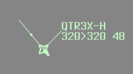
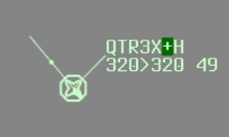
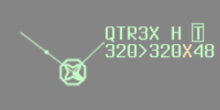
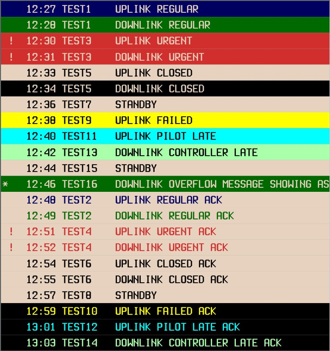
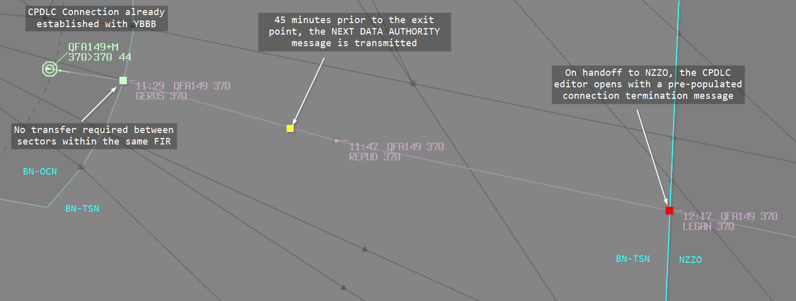

--8<-- "includes/abbreviations.md"

Controller-Pilot Data Link Communications (CPDLC) allows controllers and pilots to exchange structured text messages as an alternative to voice. In the real world, CPDLC is the primary means of communication with aircraft above `F245` when beyond VHF range.
CPDLC is routinely used over oceanic sectors, and may be used over continental sectors. Using CPDLC for short-haul operations should be avoided.

VATSIM does not officially support CPDLC. On VATSIM, [Hoppie's ACARS network](https://www.hoppie.nl/acars/) has become the de-facto standard, supported by most flight simulation addon aircraft and a variety of controller client plugins. Hoppie's network is not affiliated with VATSIM.

## Concepts

### Messages

CPDLC messages are either **uplinks** (controller to pilot) or **downlinks** (pilot to controller). Most messages are standardised templates with fields to populate. Free-text is available when no suitable template exists, but should be avoided where possible. Multiple uplink messages can be joined and sent as a single message.

### Dialogues

A dialogue is a conversation thread between an aircraft and a ground station. It is **open** while any message within it awaits a response, and **closed** once all messages are resolved. Note that `STANDBY` and `REQUEST DEFERRED` do not close a dialogue, the original request remains open until a final response is sent.

### Data Authority

Data authority determines which ground station is responsible for communicating with an aircraft.

The **Current Data Authority (CDA)** is the station actively responsible for the flight.
Aircraft may reject uplinks from any station that is not the CDA.
The **Next Data Authority (NDA)** is the station designated to take over, indicated by the `-` symbol in the track label.
New connections always begin as NDA and are promoted to CDA when the first downlink is received.

The plugin automatically sends a `NEXT DATA AUTHORITY` uplink 45 minutes before an aircraft enters a new ATSU's airspace.
This informs the pilot of the next station but does not initiate a transfer.
Some aircraft will automatically connect to the NDA on receipt.
This is expected, as aircraft can hold connections to both CDA and NDA simultaneously.

### CPDLC and PDC

**CPDLC is not PDC**. While, both use the same underlying network, they are separate systems. Refer to [OzStrips for pre-departure clearance (PDC)](./towerstrips.md#pdcs) information.

## Plugin

The [CPDLC Plugin](https://cpdlc.eoinmotherway.dev) adds CPDLC functionality to vatSys. It connects to an aggregation server that relays messages between controllers and Hoppie's ACARS network, allowing multiple controllers to share a single ATSU connection with messages routed to the correct controller automatically.

For full plugin documentation, see the [CPDLC Plugin Docs](https://cpdlc.eoinmotherway.dev).

### ATSU Codes

Historically, each sector had its own individual Hoppie station ID (e.g. `YINL`, `YTSN`). With the CPDLC server allowing multiple controllers to share a single ATSU connection, this is no longer required. Controllers should log on using the FIR-level ATSU code for their position.

| FIR | ATSU Code |
| --- | --------- |
| Brisbane | `YBBB` |
| Melbourne | `YMMM` |
| Port Moresby | `AYPM` |
| Nandi | `NFFF` |
| Honiara | `YBBB` |
| Nauru | `YBBB` |

### Connecting

Open `CPDLC > Setup`, verify the server URL and station ID, then click Connect. Your selected station becomes your primary ATSU.

### Track Label

The CPDLC label item shows each aircraft's connection status:

| Symbol | Meaning |
| :----: | ------- |
| (blank) | Not CPDLC capable |
| `.` | Connected to ACARS network, available for logon |
| `-` | CPDLC connection established, we are the Next Data Authority |
| `+` | CPDLC connection established, we are the Current Data Authority |


<figure markdown>

  <figcaption>Track label with the Next Data Authority state</figcaption>
</figure>

The label background changes when a downlink message is awaiting response. The symbol colour changes when an `UNABLE` response has been received.

<figure markdown>

  <figcaption>Track label displaying an open CPDLC downlink</figcaption>
</figure>

<figure markdown>

  <figcaption>Track label displaying an open CPDLC downlink when the `UNABLE` message is received</figcaption>
</figure>

Left-clicking the label opens the CPDLC Editor. Pilot-initiated logon requests are accepted automatically, and no controller action is required to establish a connection. If an aircraft shows `.` but has not logged on, left-clicking the label sends a `CONNECTION REQUESTED` message to initiate the connection from the controller side.

#### Voice Capability

vatSys uses `-` and `+` by default to indicate receive-only and text-only voice capabilities. To avoid confusion with the CPDLC label symbols, the plugin replaces these with a separate label item:

| Symbol | Meaning |
| :----: | ------- |
| (blank) | Fully voice capable |
| `R` | Receive only |
| `T` | Text only |
| `V` | Voice capable (only displayed when a text message is received) |

Left or right-clicking the label item opens the text message editor.

<figure markdown>

  <figcaption>Track label showing a text-only pilot</figcaption>
</figure>

### Current Messages Window

The Current Messages Window shows all open CPDLC dialogues.
Messages are colour-coded to indicate their state.
The window opens automatically when a new downlink is received and closes once all dialogues are resolved.

<figure markdown>

  <figcaption>Colour coding for CPDLC messages</figcaption>
</figure>

### Automatic Actions

The plugin handles the following automatically:

- **Logon:** Pilot logon requests are automatically accepted.
- **Next Data Authority:** The plugin calculates the next ATSU from the aircraft's route and automatically transmits a `NEXT DATA AUTHORITY` message 45 minutes before the aircraft enters that airspace.

### Limitations

- **ADS-C** is not simulated due to vatSys plugin SDK limitations.
- **Equipment codes** are ignored. The `.` symbol indicates ACARS connectivity only, regardless of filed equipment.
- **FDR auto-update** is not supported. Level changes issued via CPDLC must be manually updated in the FDR.
- Due to Hoppie's polling interval, message delivery may be delayed by up to one minute each way.
- **Aircraft compatibility** may vary. Hoppie's network does not prescribe a standard message format, so different aircraft addons may send or interpret messages differently. Some aircraft may behave unexpectedly, this is an addon limitation, not a controller error.

## CPDLC Procedures

CPDLC must only be used at enroute or oceanic positions. **CPDLC must not be used below `F245`.**

Use CPDLC as the primary means of communication with suitably equipped aircraft beyond VHF range. Avoid using CPDLC for short-haul domestic flights.
Always ensure a backup communication medium (VHF or HF frequency) has been provided to the aircraft.
Do not use CPDLC for urgent or time-critical messages. Use voice for any instruction that requires a prompt response.

Ensure you hold data authority for all CPDLC-connected aircraft under your jurisdiction. If an aircraft under your jurisdiction shows the `-` symbol, request a CPDLC position report to promote it to Current Data Authority.

If you receive a `NOT CURRENT DATA AUTHORITY` downlink, request the previous unit to send an `END SERVICE` message to the aircraft. If that is not possible, instruct the pilot to disconnect CPDLC and log on to the relevant centre.

### Managing Dialogues

Closed dialogues are acknowledged via the Current Messages Window. Always update the FDR before acknowledging a closed dialogue. If a CPDLC exchange is resolved by voice, close the dialogue with an appropriate message so the Current Messages Window stays current.

Use pre-formatted elements where possible. Avoid free-text unless no suitable template exists.

If a pilot sends duplicate downlink messages, respond identically and append the free-text element `CLEARANCE ALREADY SENT`.

### Levels and Clearances

CPDLC position reports may only be used to apply vertical separation at or above `F130`.

When issuing a conditional clearance, prepend `MAINTAIN [level]` to the uplink.
For a clearance with a level-by requirement, use `CLIMB (or DESCEND) TO REACH [level] BY [time/position]`:

```
CLIMB TO REACH 370 BY 1400.
CLIMB TO REACH 370 BY APOMA.
```

For an intermediate level requirement within a climb or descent, append `REACH [level] BY [time/position]` as a free-text element. Do not send it as a standalone message:

```
CLIMB TO 390. REACH 370 BY 100NM BEFORE ATMAP
DESCEND TO 330. REACH 330 BY 55 NM AFTER KALUG
```

For inbound aircraft without ADS-C operating under a block clearance, uplink `CONFIRM ASSIGNED LEVEL` on first contact. The expected response is `ASSIGNED BLOCK [level1] TO [level2]`. If a different response is received, reissue the block clearance.

Respond to `CRUISE CLIMB` requests with `UNABLE` followed by `CRUISE CLIMB PROCEDURE NOT AVAILABLE IN AUSTRALIAN ADMINISTERED AIRSPACE`.
Do not include a climb instruction in the reply.

### Multi-Element Messages

When a pilot sends multiple requests in a single downlink and all can be approved, address each element in one response. If any element cannot be approved, respond with `UNABLE`, then send a separate uplink for the elements that can be approved:

```
PILOT: REQUEST CLIMB TO [level]. REQUEST DIRECT TO [position].
ATC:   UNABLE
(separate dialogue)
ATC:   PROCEED DIRECT TO [position].  
```

### Delays

When a request cannot be immediately actioned:

| Situation | Response |
| --------- | -------- |
| Request cannot be met | `UNABLE [DUE TRAFFIC/AIRSPACE]` |
| Being assessed, response within 10 minutes | `STANDBY` |
| Delay greater than 10 minutes expected | `REQUEST DEFERRED` |

After responding with `STANDBY`, follow up within 10 minutes to advise of progress.

### Weather Deviations

When issuing a weather deviation, include the approved deviation along with a return instruction, either `WHEN ABLE PROCEED DIRECT TO [position]`, `REPORT BACK ON ROUTE`, or `REJOIN ROUTE BY [position/time]`. Check any free-text in the pilot's request and amend the direction or distance as necessary before issuing.

### Transfers

When transferring an aircraft to the next sector, handoff the tag to the next controller as normal. When the handoff is accepted, issue frequency transfer instructions via voice or CPDLC, then transfer the CPDLC connection if necessary (for handoffs to a [different FIR](#to-a-different-fir)).

<figure markdown>

  <figcaption>CPDLC transfer behavior along a route</figcaption>
</figure>

#### Within the Same FIR

No CPDLC connection transfer is required when handing off an aircraft between sectors within the same FIR. The CPDLC connection remains active with the same ATSU.

Controllers must still manually issue frequency transfer instructions to the aircraft via voice or CPDLC as appropriate.

If open CPDLC dialogues exist at handoff, coordinate with the receiving sector.

If the receiving sector cannot accept the aircraft with open dialogues, delay the handoff until all dialogues are closed, or close the dialogues before transfer.

#### To a Different FIR 

When handing off to a different FIR, send the `END SERVICE` and frequency transfer instructions via the CPDLC editor:

```
END SERVICE.
CONTACT AUCKLAND RADIO ON 8.867.
```

The CPDLC connection will remain active until the pilot responds (typically `WILCO`) and the dialogue closes. This ensures the pilot acknowledges the frequency instructions before losing CPDLC connectivity.

!!! note
    If `END SERVICE` is sent alone without additional message elements, the connection terminates immediately since no response is required.

If open CPDLC dialogues exist before transferring to another FIR, send `CHECK AND RESPOND TO OPEN CPDLC MESSAGES` before initiating the transfer.
Coordinate any delay in transferring the CPDLC connection with the receiving ATSU, and advise the pilot using `EXPECT CPDLC TRANSFER AT [time]`.

For aircraft entering a non-CPDLC FIR, send `END SERVICE` within 10 minutes after the frequency transfer point.

#### From a Different FIR

If the previous FIR is CPDLC equipped and uses the CPDLC server software, the aircraft may have received a `NEXT DATA AUTHORITY` message and initiated logon before the FIR boundary. Once the aircraft is within your jurisdiction, request a position report to promote the CPDLC status to Current Data Authority if not already.

If receiving from a non-CPDLC FIR, initiate the connection and request a position report.

If a connection request fails with `CONNECTION REQUEST FAILED. CURRENT DATA AUTHORITY [unit name]`, ask the previous unit to re-send the `NEXT DATA AUTHORITY` message, then manually send another `CONNECTION REQUEST`.
If connection attempts continue to fail, instruct the pilot to disconnect CPDLC and continue on voice.
